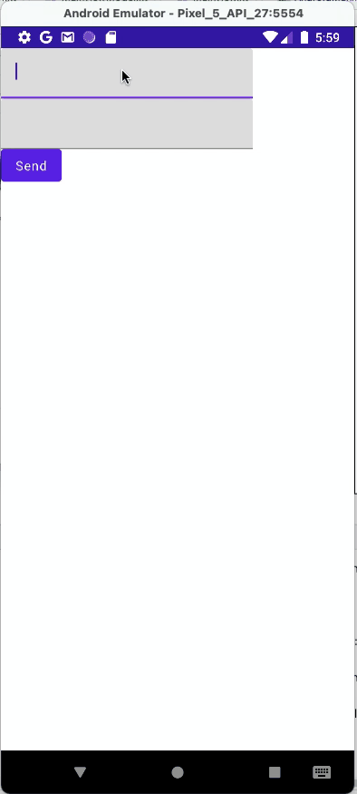

# android-test-drill

<!-- # Short Description -->

This repository has sample code for unit test on kotlin, Android. It is for self-study.

I posted the article to Zenn[[4](https://zenn.dev/akira_kashihara/articles/03d1e2496eb2a5) ]but it is written in Japanese.

このリポジトリは、unit test のサンプルコードを共有するためのもの。基本的には個人的な勉強のために使っています。

Zenn[[4](https://zenn.dev/akira_kashihara/articles/03d1e2496eb2a5)]に記事として投稿しています。

<!-- # Badges -->

# Tags

`kotlin` `Android` `Unit Test`

# Branch

- main : only base sample application / 基本のサンプルアプリのみ
- unit-test : base sample application and unit test code / サンプルアプリとユニットテストコード

# Demo

Sample Application Behavior.
サンプルプログラムの動きです。

# Reference

The 1st and 2nd reference were refered to make code for unit test. The 3rd reference was refered to make MVVM architecture.

文献 1 と 2 は、Unit Test のコードの参考に、文献 3 は MVVM を構築するためのファイル構造とソースコードの参考に致しました。

1. Belal Khan, "Android Unit Test Tutorial – Writing Your First Unit Test", 2021, [https://www.simplifiedcoding.net/android-unit-test-tutorial/](https://www.simplifiedcoding.net/android-unit-test-tutorial/) (accessed 2021-12-23)
2. Android, "Test your app", [https://developer.android.com/studio/test](https://developer.android.com/studio/test) (accessed 2021-12-23)
3. Toshiki Okuzawa, "Jetpack Compose による Android MVVM アーキテクチャ入門", 株式会社インプレス R&D, 2021, ISBN978-4-295-60053-4 (only Japanese)
4. Akira Kashihara, "Android kotlin で Unit Test を体験してみた", [https://zenn.dev/akira_kashihara/articles/03d1e2496eb2a5](https://zenn.dev/akira_kashihara/articles/03d1e2496eb2a5) (accessed 2021-12-24)

# Contact

Akira Kashihara \<akira.kashihara@hotmail.com>

# License

I wrote to LICENSE file.

# Contributors

- [KASHIHARAAkira](https://github.com/KASHIHARAAkira)

<!-- CREATED_BY_LEADYOU_README_GENERATOR -->

This README.md was generated by [LEADYOU](https://leadyou.hacknock.com)
